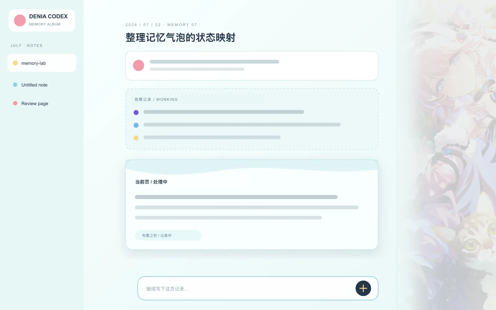

# 达妮娅 · 旧日斑斓 Codex Theme

`denia-old-days@0.1.0` 是一套面向 Codex Desktop 的双形态手账主题。浅色首页使用暖色拍立得构图，深色首页切换为全景画面；任务页会随工作、审批、错误和完成状态改变右侧美术。




## 主要特性

- 浅色、深色首页使用独立构图。
- 任务状态对应四组本地 WebP 美术。
- 原生右侧栏支持窄幅人像与宽幅场景切换。
- Sidecar 可独立安装、启动、验证、停止和卸载。
- 运行时只读取包内资源，不发起远程素材请求。
- Kaboo 布局合同覆盖桌面与窄屏的首页、任务页。

## 环境要求

- macOS，支持 Apple Silicon 与 Intel。
- Codex Desktop。
- Node.js 20 或更高版本。
- Kaboo CLI，且包含 `codex-theme` 命令。

## 从源码运行检查

```bash
npm ci
npm run build:assets
npm run check
```

`build:assets` 会从 `art/source/` 生成 Base Theme 背景、Sidecar WebP 和两张公开预览。生成文件不纳入 Git。

## 构建 Kaboo 发布物

```bash
npm run build:kaboo
npm run check:kaboo
```

输出目录：

```text
sidecar/release/kaboo-local/denia-old-days/0.1.0/
├── bundle.zip
├── catalog-version.json
├── manifest.json
├── preview-home.webp
└── preview-task.webp
```

`check:kaboo` 会检查 ZIP 单根目录、三处包身份、README v1、布局合同、预览字节、catalog 哈希以及 `SHA256SUMS` 全覆盖。

Changing any published package byte requires a new semantic version.

## Kaboo 预览

保持 Codex 位于对应页面，每个目标分别执行一次。`--output` 必须指向尚不存在的专用目录；macOS 上使用真实路径 `/private/tmp`，不要使用 `/tmp` 别名。

```bash
kaboo-cli codex-theme preview-local \
  sidecar/release/kaboo-local/denia-old-days/0.1.0/catalog-version.json \
  --target home-desktop \
  --output /private/tmp/denia-old-days-home-desktop

kaboo-cli codex-theme preview-local \
  sidecar/release/kaboo-local/denia-old-days/0.1.0/catalog-version.json \
  --target home-narrow \
  --output /private/tmp/denia-old-days-home-narrow

kaboo-cli codex-theme preview-local \
  sidecar/release/kaboo-local/denia-old-days/0.1.0/catalog-version.json \
  --target task-desktop \
  --output /private/tmp/denia-old-days-task-desktop

kaboo-cli codex-theme preview-local \
  sidecar/release/kaboo-local/denia-old-days/0.1.0/catalog-version.json \
  --target task-narrow \
  --output /private/tmp/denia-old-days-task-narrow
```

布局目标和断言见 [`sidecar/layout-contract.json`](sidecar/layout-contract.json)。

## 本地安装与验证

```bash
kaboo-cli codex-theme install-local \
  sidecar/release/kaboo-local/denia-old-days/0.1.0/catalog-version.json

kaboo-cli codex-theme verify denia-old-days
```

如果安装结果为 `prepared`，按 CLI 提示显式激活：

```bash
kaboo-cli codex-theme activate denia-old-days --restart
kaboo-cli codex-theme verify denia-old-days
```

安装和普通切换不会自行重启 Codex；只有带 `--restart` 的激活命令会进入明确的重启流程。

## 发布到 Kaboo

发布前应完成两次独立构建比对、四个目标的 `preview-local`、本地安装和最终验证。随后确认当前账号对应的发布主体：

```bash
kaboo-cli login
kaboo-cli codex-theme publishers
```

发布命令：

```bash
kaboo-cli codex-theme publish \
  sidecar/release/kaboo-local/denia-old-days/0.1.0/catalog-version.json \
  --tag light
```

已发布的 `id@version` 不可覆盖。任何文件发生变化，都要提升语义化版本并重新生成完整发布物。

## 发布到 GitHub

仓库不预设远端。创建空 GitHub 仓库后执行：

```bash
git remote add origin git@github.com:<owner>/denia-old-days-codex-theme.git
git push -u origin main
```

推送前建议再次运行：

```bash
npm ci
npm run check
npm run build:kaboo
npm run check:kaboo
git status --short
```

## 目录

```text
art/source/   固定构建输入
canon/        视觉设定与素材清单
previews/     GitHub 与 Kaboo 公开预览
scripts/      资源生成、源码检查和发布构建
sidecar/      可卸载的组件层、运行时与布局合同
theme/        Portable Base Theme 定义
```

Sidecar 使用 `cdp-loopback-v1` 连接本机 `127.0.0.1` 的指定 Codex renderer，不修改 Codex 应用、签名、账号、模型或 API 配置。

## 常见问题

- `npm run check:kaboo` 找不到 catalog：先运行 `npm run build:kaboo`。
- `preview-local` 提示输出目录已存在：换一个新的 `--output` 路径。
- 任务目标无法打开：先在 Codex 中打开一个已有任务，再重跑对应目标。
- `verify` 报布局漂移：修改源码、重新构建并提升版本，不要直接改已安装副本。
