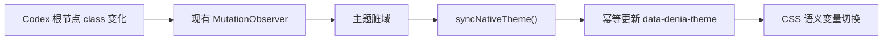

# 达妮娅深色主题适配设计

## 设计目标

本次改动补齐 Codex 深色模式下的主题状态同步、首页视觉、任务主栏和注入组件配色。浅色主题保留现有视觉和交互。

验收目标：

- Codex 在 `electron-light` 与 `electron-dark` 之间切换时，主题在同一渲染周期内同步。
- 深色首页使用独立的暗形态视觉，不复用浅色暖纸主页。
- 深色任务主栏、侧栏、输入区、观察卡和完成卡属于同一冷色表面体系。
- 普通正文对比度不低于 `7:1`，次要文字和控件不低于 WCAG AA。
- 不增加持续动画、滚动监听、MutationObserver 或运行时网络请求。

## 现状问题

当前根样式固定使用 `color-scheme: light`。运行时没有把 Codex 的 `electron-light`、`electron-dark` 同步到 `data-denia-theme`。

以下组件仍使用硬编码浅色值：

- 首页背景、Hero、照片框和状态标签；
- 左侧栏、右侧栏、分组和项目行；
- 输入区、发送按钮和附件按钮；
- 观察卡和完成卡；
- 减少透明度模式下的实色回退。

任务页虽然已定义深色背景变量，但没有可靠的主题激活入口。深色背景与浅色文字规则混用后，主栏会出现低对比文字和未变色表面。

## 采用视觉方向

深色首页采用“暗形态直视”方案，使用仓库内的 `art/source/official/denia-dark-direct-gaze.jpg`。

视觉规则：

- 基底使用墨蓝紫，不使用纯黑。
- 主要表面使用深靛蓝和灰紫蓝，通过色阶区分层级。
- 交互焦点统一使用晶体蓝。
- 灰莓紫和粉紫只用于角色反光、状态和少量装饰。
- 正文使用柔白色，次要文字使用薰衣草灰。
- 不使用霓虹外发光、全屏模糊、噪点纹理或高饱和紫色网格。

设计参数保持为：

| 参数 | 数值 | 约束 |
| --- | ---: | --- |
| `DESIGN_VARIANCE` | 5 | 保留现有布局，只重组深色 Hero 的视觉关系 |
| `MOTION_INTENSITY` | 3 | 只保留现有状态过渡和控件反馈 |
| `VISUAL_DENSITY` | 5 | 维持 Codex 原生工作区的信息密度 |

## 定义深色语义色板

深色模式使用以下基础值：

| 语义 | 色值 | 用途 |
| --- | --- | --- |
| 画布 | `#12142F` | 页面和任务主栏 |
| 基础表面 | `#1A1C3A` | 侧栏、输入区和普通容器 |
| 抬升表面 | `#202348` | 活跃项目、完成卡和重点控件 |
| 主文字 | `#F3EFF6` | 标题、正文和主要控件文字 |
| 次要文字 | `#BBB5C9` | 辅助说明、时间和占位文字 |
| 焦点色 | `#8DC5EA` | 焦点环、选中边界和主要操作 |
| 角色粉 | `#D98FB3` | 状态反光和少量角色装饰 |
| 分界线 | `rgba(141, 154, 211, .30)` | 容器、分组和输入区边界 |

关键对比度：

| 前景与背景 | 对比度 |
| --- | ---: |
| `#F3EFF6` / `#12142F` | `15.84:1` |
| `#BBB5C9` / `#12142F` | `9.06:1` |
| `#F3EFF6` / `#1A1C3A` | `14.54:1` |
| `#BBB5C9` / `#1A1C3A` | `8.31:1` |
| `#F3EFF6` / `#202348` | `13.25:1` |
| `#BBB5C9` / `#202348` | `7.57:1` |
| `#11142B` / `#8DC5EA` | `9.76:1` |

粉紫不作为普通文字颜色。错误、审批和完成状态保留现有语义色，但必须落在深色表面上通过对比度检查。

## 同步宿主主题

运行时以根节点 class 为主题来源：

```text
electron-dark  -> data-denia-theme="dark"
electron-light -> data-denia-theme="light"
```

同步流程：



规则：

- 初次注入时先同步主题，再装饰页面。
- 根 class 变化只调度主题脏域。
- class 暂时缺失或同时出现时，保留最近一次有效主题。
- 首次状态无法识别时使用浅色，避免把浅色 Codex 错配为深色。
- 清理时删除 `data-denia-theme`。
- 不新增 `matchMedia` 监听、MutationObserver 或定时器。

根节点在深色模式下设置 `color-scheme: dark`，浅色模式设置 `color-scheme: light`。原生表单控件和滚动条由浏览器使用对应色彩方案。

## 重做深色首页

浅色首页保持现状。深色首页复用现有 DOM，只改变资源和绘制方式。

### 首页背景

- 移除浅色模式的暖纸底和剧情画面。
- 使用 `#12142F` 纯色基底与静态径向渐变。
- 渐变只绘制灰莓紫、靛蓝和低强度晶体蓝，不使用 `filter: blur()`。

### Hero

- Hero 继续使用现有宽度、间距和响应式边界。
- 深色模式改为单一“记忆窗”，角色图铺在 Hero 右侧。
- 左侧使用高不透明墨蓝渐变承载标题，正文区域不直接压在角色脸部和高亮服装上。
- 取消深色模式下的纸张背板、拍立得边框和暖色阴影。
- 隐藏深色 Hero 的额外泡泡装饰，使用原图已有泡影。
- 标题、状态和输入区均位于可预测的纯色或高不透明表面上。

### 图片管线

- 从现有官方源图生成 `sidecar/assets/denia-home-dark.webp`。
- 在 `extension.json` 增加深色首页资源键。
- loader 在启动时读取资源并注入运行时模板。
- runtime 创建一次对象 URL，并设置 `--denia-old-days-art-dark`。
- cleanup 撤销对象 URL 并移除对应 CSS 变量。
- WebP 必须小于 `1 MiB`，运行时不访问网络。

## 适配注入组件

### 左侧栏

- 面板使用基础表面，项目分组使用轻微深浅差。
- 活跃项目使用抬升表面、晶体蓝左边界和柔白文字。
- hover 只调整背景色与内边界，不使用发光。
- 品牌卡、标题和副标题使用深色语义变量。

### 右侧栏

- 面板、分组和项目行使用不透明度不低于 `.97` 的深色表面。
- 原生内容覆盖任务人物图时保持清晰，不透出影响文字的高亮区域。
- 工作、审批、错误和完成状态只改变边界色与克制阴影。
- 不修改侧栏几何、滚动和交互。

### 输入区

- 输入区使用基础表面和晶体蓝细边。
- 输入文字、占位文字、附件按钮和发送按钮分别使用主文字、次要文字和焦点色组合。
- 发送按钮使用晶体蓝背景与深墨文字，对比度为 `9.76:1`。
- 不改变输入区尺寸、按钮位置和原生行为。

### 任务内容

- 主栏继续使用已存在的深色任务背景和静态柔焦渐变。
- 根文字色切换为柔白色，次要文字切换为薰衣草灰。
- 不覆盖原生语法高亮、diff、终端和代码编辑器颜色。
- 观察卡使用低强度灰紫蓝背景和晶体蓝虚线边界。
- 完成卡使用抬升表面、柔白正文和低强度金粉顶部状态带。

## 处理响应式与辅助功能

- 小于 `920px` 时继续隐藏任务人物栏。
- 深色 Hero 在窄屏提高左侧遮罩强度，角色图向右偏移，标题保持完整可读。
- `prefers-reduced-transparency: reduce` 使用实色画布和实色组件表面。
- `prefers-reduced-motion: reduce` 继续关闭主题动画和过渡。
- 焦点环在两种主题中保持 `3px`，颜色使用晶体蓝。
- 不用颜色单独表达审批、错误或完成状态，保留原生文字与控件语义。

## 控制性能

- 新增一张构建期 WebP，不新增运行时解码链路。
- 主题切换不创建、删除或移动首页和任务页节点。
- 主题切换不重新创建人物图对象 URL。
- 不新增布局读取、滚动监听、动画帧循环或全屏滤镜。
- 主题脏域只检查根 class，并通过现有帧调度合并重复 mutation。
- 稳定首页和任务页在等价两秒观察窗口内的 refresh 增量继续不超过四次。
- 面板开关性能预算保持现有标准。

## 处理异常与降级

| 场景 | 处理 |
| --- | --- |
| 根 class 暂时缺失 | 保留最近一次有效主题 |
| 初次注入无法识别主题 | 使用浅色 |
| 深色首页图片加载失败 | 使用深色纯色和静态渐变，保留文字与输入区 |
| 减少透明度开启 | 禁用透明表面和背景渐变 |
| 减少动态效果开启 | 立即切换状态，不执行过渡 |
| Sidecar cleanup | 删除主题 marker、CSS 变量、对象 URL 和主题节点 |

## 验证设计

### 静态测试

- 根样式不再永久固定为浅色。
- 深色变量覆盖全部注入组件。
- 浅色变量和现有浅色选择器保持原值。
- 深色选择器不修改任务布局属性。
- 新图片通过来源、尺寸、体积和构建清单检查。
- 对比度测试覆盖主文字、次要文字、输入区和主要按钮。

### 运行时测试

- 初始 `electron-light` 映射为 `data-denia-theme="light"`。
- 初始 `electron-dark` 映射为 `data-denia-theme="dark"`。
- 根 class 切换后 marker 在下一帧前同步。
- 重复相同 class mutation 不产生冗余写入。
- 临时无 class 状态保留最近主题。
- cleanup 删除 marker 并撤销深色首页对象 URL。
- 主题切换不增加 `createdNodes`、`artGeneration` 或观察器数量。

### 实机检查

- 浅色首页与当前截图一致。
- 深色首页使用暗形态直视画面，标题和输入区不压在高亮人物区域。
- 深色任务主栏的普通文字、链接、代码、工具结果和状态提示清晰可读。
- 左侧栏、右侧栏、输入区、观察卡和完成卡全部变色。
- 审批、错误、完成和工作状态保持原有识别与人物图映射。
- 窄屏没有水平溢出。
- 减少透明度和减少动态效果模式正常。
- `npm run check`、本地 Kaboo 构建和安装后实时验证通过。

## 限定变更范围

允许修改：

- `sidecar/src/denia-old-days-extension.css`
- `sidecar/src/denia-old-days-extension.js`
- `sidecar/runtime/loader.mjs`
- `sidecar/extension.json`
- `sidecar/tests/validate.mjs`
- `scripts/render-assets.mjs`
- `scripts/check-source.mjs`
- `scripts/release-inputs.mjs`
- 当前设计说明和相关文档

不修改：

- Codex 原生布局、文案、按钮顺序和交互。
- 任务状态判断优先级和人物图映射。
- 浅色首页构图和现有浅色颜色。
- 安装、启动、卸载和发布行为。
- 网络、账户、模型和 API 配置。

## 写作说明

本文面向主题维护者和评审者，记录深色视觉、状态同步、资源管线、性能边界和验收口径。实施细节将在设计确认后的实施计划中拆分。
